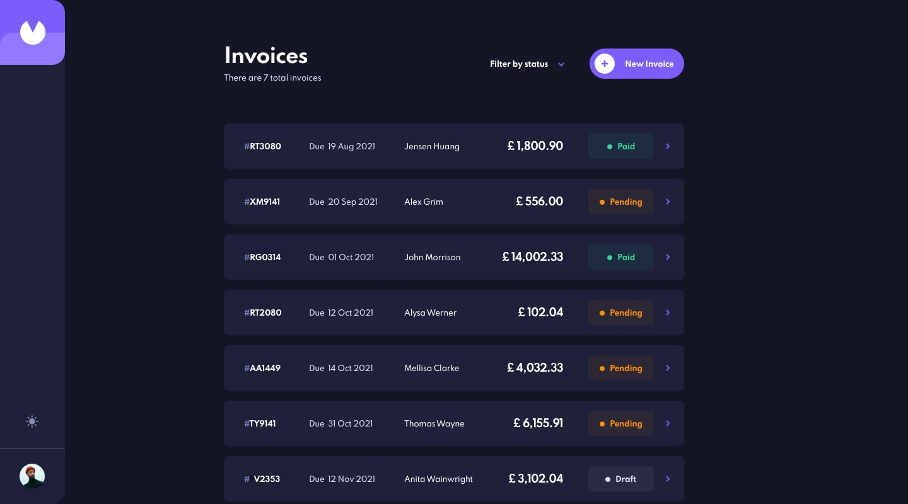

# Invoicy Platform

> Invoicing platform for freelancers



Invoicy is a platform for freelancers to easily build invoices and send them to their clients.

## Built With

- Ruby
- Rails
- PostgreSQL
- Redis
- Sidekiq
- React
- Context API
- React Router
- Styled Components
- Typescript
- Webpack
- RSpec

## Live Demo

[Live Demo Link](https://demo.invoicy.lat/)
[See here our components library](https://invoicy-storybook.vercel.app/?path=/story/components-button--default)


## Getting Started

To get a local copy up and running follow these simple example steps.

### Prerequisites

- Node 16.19
- Yarn
- Ruby 3.1.2
- Postgres
- Redis

### Setup

1. Clone the project repository
  ```bash
  git@github.com:mapra99/invoicy.git
  ```
2. `cd` into the project folder and install ruby dependencies
  ```bash
  cd invoicy
  bundle install
  ```
3. Create a .env file based on the existing .env.sample file_
  ```bash
    cp .env.sample .env
  ```
4. Follow the instructions on the .env file regarding the vendors variables that need  to be configure
5. Set up the database
  ```bash
    rails db:setup
  ```
6. Install node dependencies
  ```bash
    yarn install --dev
  ```
6. Start the rails server
  ```bash
    rails s
  ```
7. On a separate terminal, start webpack dev server
  ```bash
    bin/webpack-dev-server
  ```
8. On a separate terminal, run sidekiq
  ```bash
    bundle exec sidekiq
  ```

### Usage
Go to http://localhost:3000 and navigate through the site.

### Deployment
This app demo site is hosted on Fly.io. Run the following to trigger a deploy
```bash
# This will create a new app called invoicy if it does not exist on your account
flyctl launch --config fly.toml

# This will create a new deploy on the existing invoicy app on your account
flyctl deploy --config fly.toml
```

## Author

**Miguel Prada**

- Github: [@mapra99](https://github.com/mapra99)
- Linkedin: [mprada](https://linkedin.com/in/mprada)

## Contributing

Contributions, issues, and feature requests are welcome!

Feel free to check the [issues page](issues/).

## Show your support

Give a star if you like this project!

## Acknowledgments

- frontendmentor.io for their amazing designs and its community!

## License

This project is [MIT](lic.url) licensed.
